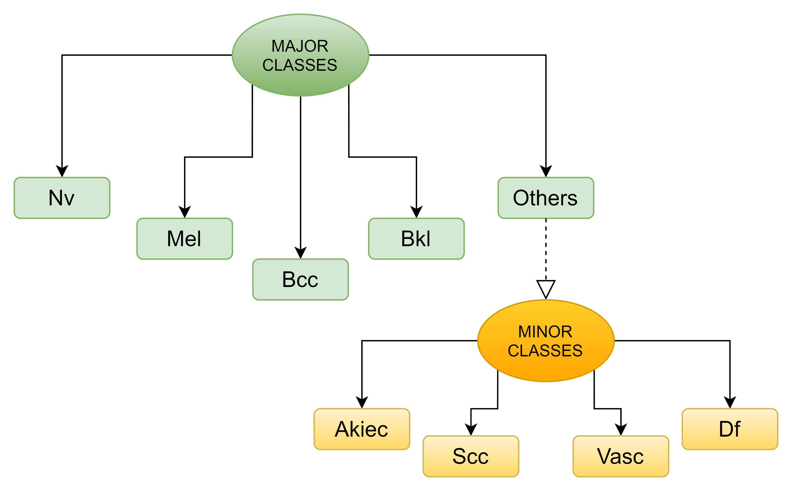
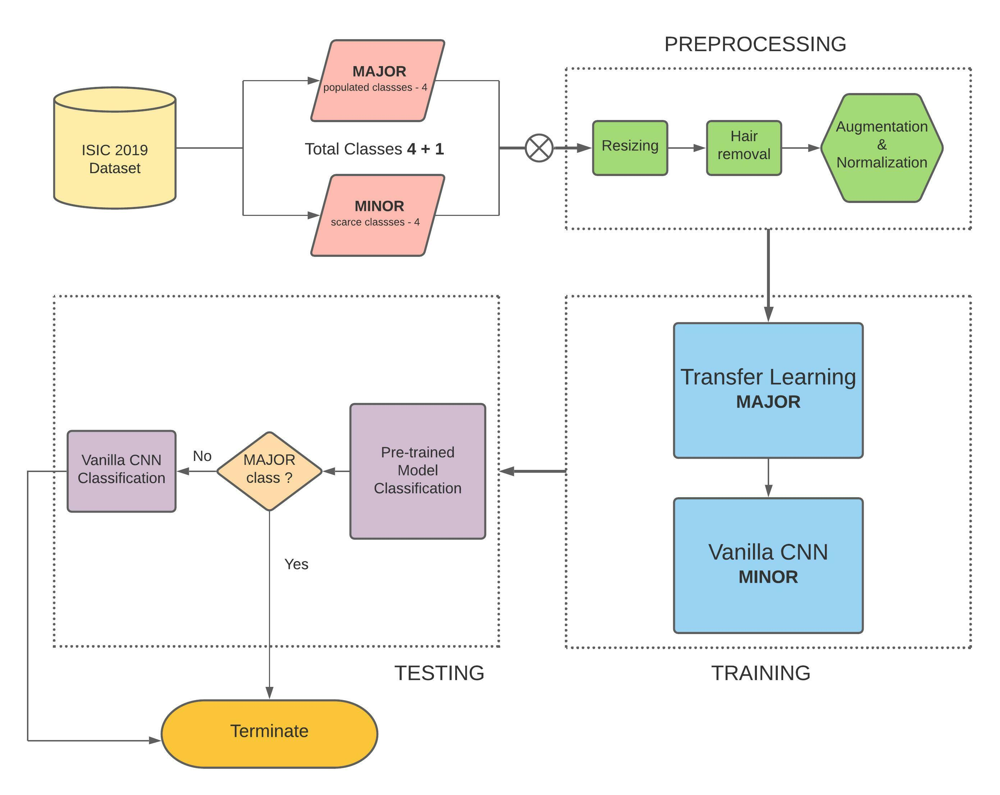
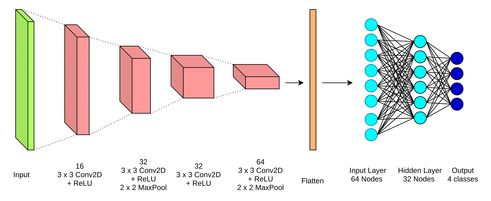

# Lopsided-Lesion-Class-Diagnosis

## A novel dual model approach for categorization of unbalanced skin lesion image classes

### Authors: Shrey Dedhia, Siddharth Trivedi, Siddharth Salvi, Jay Jani, and Lynette D’mello 
#### Presented in the 5th International Conference on Computational Vision and Bio Inspired Computing (ICCVBIC - 2021) on November 25, 2021
#### Advances in Intelligent Systems and Computing - Springer (Series ISSN : 2194-5357)

## Abstract

Skin cancer is one of the most prevalent types of cancer, with non-melanoma skin cancer being the 5th most commonly occurring cancer worldwide. In the United States alone, more than 9,500 people are diagnosed with skin cancer every day while two people succumb to the disease every hour. Like most other cancers, each skin cancer type also begins as a precancerous lesion. Hence, it becomes of utmost importance to detect the malignant skin lesion as early as possible. While there have been many computer-aided techniques in use for the diagnosis of skin cancer, deep neural network-based architectures have proven to outperform traditional diagnostic methods. In this paper, we have proposed a dual-model pipeline as a solution to the task of classifying skin lesion images into 8 different classes. The ISIC 2019 challenge training dataset is utilized and divided into two sub-datasets based on the number of images in each class and then followed by few data augmentation techniques to eliminate class imbalance. Several transfer learning models, namely DenseNet169, ResNet50, Inception V3, and MobileNetV2, have been leveraged, where ResNet50 has showcased the best results for the classification task. A custom-made CNN is also used as the second model in the pipeline. This architecture demonstrates an enhanced performance for the classification task over the ISIC 2019 dataset.

## Dataset

ISIC 2019 challenge test dataset is a composition of the images from HAM10000 and BCN20000 datasets. This dataset comprises of a total of 25,331 images among 8 different classes. The 8 classes and the distribution of images among them is such that, Melanocytic nevus (Nv) has 12875 images, Melanoma (Mel) has 4522 images, Basal cell carcinoma (Bcc) has 3323 images, Benign keratosis (Bkl) has 2624 images, Actinic keratosis (Akiec) has 867 images, Squamous cell carcinoma (Scc) has 628 images, Vascular lesion (Vasc) has 253 images and Dermatofibroma (Df) has 239 images.

## Selected Figures

#### Major Minor classes division

#### Proposed pipeline

#### Our vanilla CNN architecture

